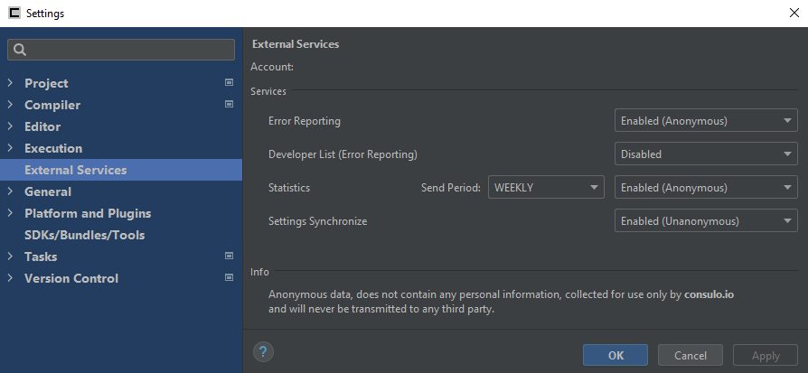

!!! warning "While Error Reporting and Statistics data is anonymous and does *not* contain any personal information, Developer List and Settings Synchronize data are *not* anonymous and may contain personally identifiable information."
!!! note "This information is collected for use only by [Consulo.io] and will never be transmitted to any third party."

This is where you manage your [Consulo.io] services.

The [Consulo.io] account you are signed into is shown at the top of the window.

## Services

- Error Reporting - **Default: Enabled** (Anonymous) 
	Whether to send anonymous error reporting data to [Consulo.io]. 
	This helps the developer(s) maintain the IDE and fix these errors. 
	This data **is** anonymous.
- Developer List (Error Reporting) - **Default: Disabled** 
	Whether to attach a list of developers to your error reporting data when it is sent to [Consulo.io]. 
	<!--- Why? ---> 
	This data ***is not*** anonymous.
- Statistics - Default: **Enabled (Anonymous)** 
	Whether to send statistical analytics data to [Consulo.io]. 
	This helps the developer(s) understand the common usage of the IDE. 
	This data **is** anonymous. 
	- Send Period 
		The frequency in which to updates about your usage statistics to [Consulo.io]. 
- Settings Synchronize - **Default: Disabled** 
	Whether to synchronize your IDE settings with your [Consulo.io] account. 
	This helps you keep your IDE settings across multiple installations of Consulo. 
	This data **is not** anonymous.

<!--- Links --->
[Consulo.io]:(Consulo.io)

