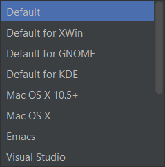
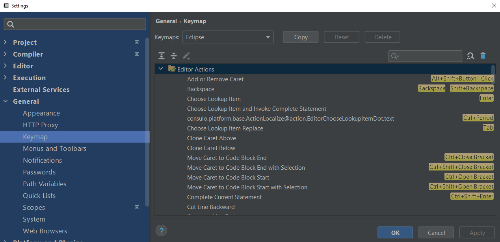

!!! info "See also"
    [Default Keymap Reference]

---

The keymap settings page can be used to remap keyboard shortcuts.
For a full list of default key mappings, see the [Default Keymap Reference].

You may choose a pre-defined keymap from the list, or create your own custom mappings.
This may be especially useful to you if you are migrating from a different editor.

There are several keymaps available based on other editors,
including Eclipse, IntelliJ, Visual Studio, VS Code, and NetBeans.

To change a shortcut mapping, right-click an entry in the list,
and select either *Add Keyboard Shortcut* or *Add Mouse Shortcut*.
Then press apply to save your settings.

<!--- Links --->
[Default Keymap Reference]:(/platform/keymap/overview.md)

