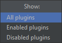
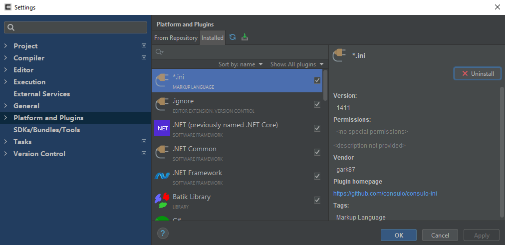
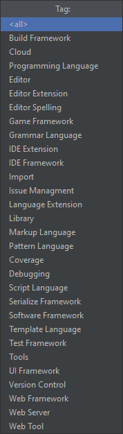
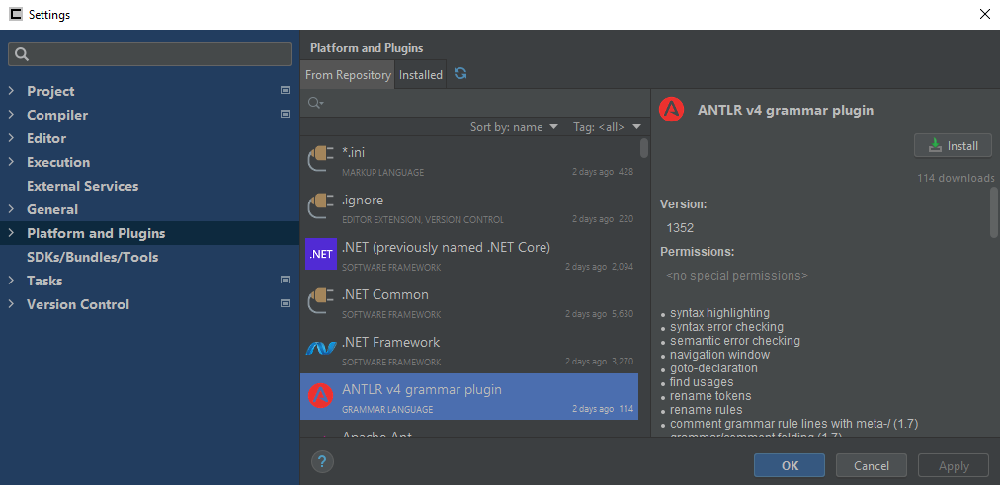

The *Platform and Plugins* page is used to manage the currently installed and enabled plugins.

The list of plugins can be reloaded by pressing the
 button located at the top of the window.

The search bar seen at the top of the page can be used to find specific plugins.

Each plugin listed has relevant information attached, such as the latest and/or installed version number, the features of the plugin,
the name of the author, and the repository for the plugin's code.
To view this information, select a plugin from the list.
Plugins also list their tags just below their title.

Installing, uninstalling, enabling, or disabling a plugin may require the IDE to be restarted for changes to take effect.

## Installed

The *Installed* tab shows the currently installed plugins.

Plugins can be installed locally from your computer by clicking the
 button located at the top of the
window, next to the  button.

The list can be filtered with the *Show* drop-down menu.

An installed plugin can be removed by selecting it and pressing the <kbd>Uninstall</kbd> button.

An installed plugin can be toggled on or off by clicking the checkbox to the right of the plugin in the list.

## From Repository

The *From Repository* tab shows plugins that are listed on the plugin repository.
On this tab, you can find an install supported plugins for Consulo.

The list can be filtered with the *Tag* drop-down menu. This menu will list the available plugin tags.

Each listing shows the last time it was updated and the amount of downloads on the right.

Plugins can be downloaded and installed by simply selecting one and pressing the <kbd>Install</kbd> button.

