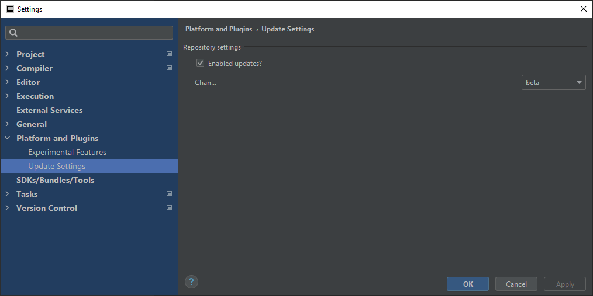
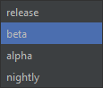

!!! info "See also"
	[Update Channels](../update_channels.md)

Update Settings is the page for configuring updates Consulo.

## Repository Settings

- Enable Updates?
	Whether to check for updates from the web.
- Channel
	The update channel to use.

	Consulo has four public update channels:

     * **release** (every monday new builds come at 00:00)
     * **beta** (every day new builds come at 00:00)
     * **alpha** (by hand on my own will (@VISTALL))
     * **nightly** (after each commit to platform or plugin)

	

---

## Updating on a Different Channel

To update on a different channel, change the *Channel* setting, and then click **Help -> Check for Update**.

If you would only like to use this channel once, you can then switch the *Channel* setting back to the previous choice.

!!! warning WARNING
    In **nightly** and **alpha** channels sometimes plugins don't have builds for the new platform. (For example if compilation failed.)

    **Keep calm - Consulo do not allow update, if some plugins missed, you will get warning about it.**
<!--- Editor's note: @Vistall Can you rephrase that please? --->

