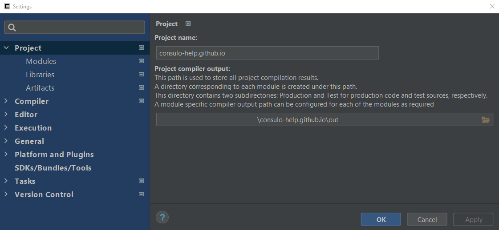

!!! warning "Work In Progress"

Project settings are settings that relate directly to your project.

!!! note "Project settings may be managed by a plugin such as Gradle."

- Project name 
	The name of your project. 
	This is usually the same as the name of your project folder.
- Project compiler output
	This path is used to store all project compilation results. 
	A directory corresponding to each module is created under this path. 
	This directory contains two subdirectories: Production and Test for production code and test sources, respectively. 
	A module specific compiler output can be configured for each of the modules as required. 
	 
	By default, this is set to `$projectPath\out`.
