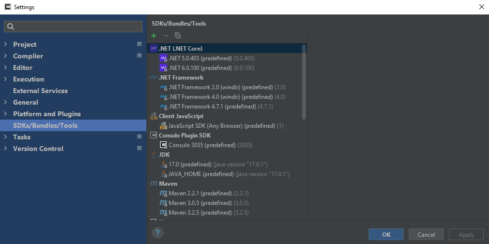

!!! warning "Work In Progress"

SDKS/Bundles/Tools is the page for configuring your SDKs, Bundles, and Tools.

To add a new SDK, click the  button at the top of the window.

You will have a list of choices based on the platform plugins you have installed.

If you do not have the required plugin for your platform, see the [Platform and Plugins] page.

To remove an SDK, select it in the list and click the
  button at the top of the window. 
**Predefined SDKs are automatically resolved, and are not able to be removed via this menu.**
**You must uninstall them from your computer, then restart the editor.**

To copy an SDK, press the  button at the top of the window.

For more information about the options provided for each platform, see the help page for the platform plugin.

!!! info "See Also"
	[Platform and Plugins] preferences
	[Setting Up Unity] guide

<!--- Links --->
[Platform and Plugins]:(./platform.and.plugins.md)
[Setting Up Unity]:(/plugins/consulo.unity3d/setup.md)

