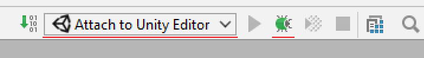

### Debugging Unity Editor with Consulo

 - From within the Unity Editor, select a script in your project and edit it using Consulo (see earlier instructions on how to link Consulo as a Script Editor for Unity)
 - Now change around some code, and add a breakpoint somewhere you can control
 - Once done, save the code from within Consulo
 - Next, select the <kbd>Attach to Unity Editor</kbd> button in the top-right:

 - Press **Debug** action (unity console will be opened)
 - Return to the Unity Editor, run the scene
 - Cause the breakpoint to trigger, and you'll notice that execution pauses at the breakpoint, with the full call stack available to Consulo
