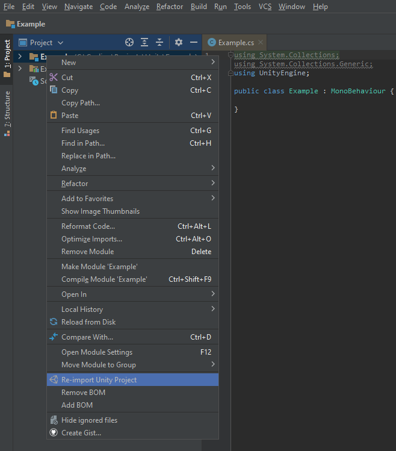

# Before

Before using Unity inside Consulo, the Unity3D plugin is required. See [Setup](setup.md) page for instructions.

# Common Issues
 * After external project change, **Re-import Unity Project** must be called manually
   